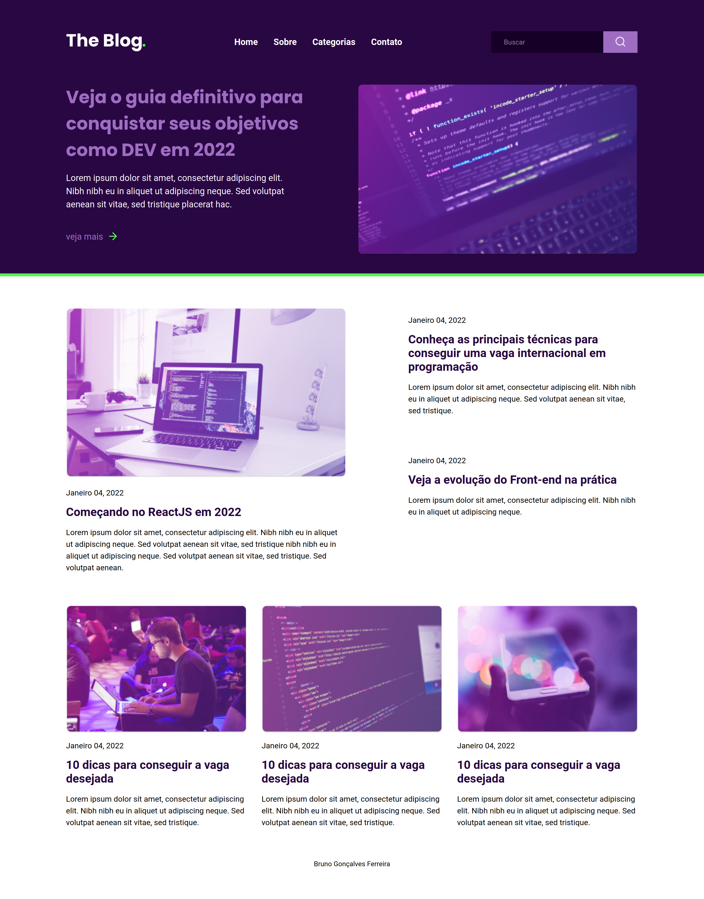
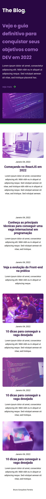

<h1 align="center">
    Desafio: RocketBlog
</h1>

 <a href="#-sobre-o-projeto">Sobre</a> •
 <a href="#-layout">Layout</a> •
<a href="#-tecnologias">Tecnologias</a> •
<a href="#-autor">Autor</a> •

## 💻 Sobre o projeto

Neste desafio criamos uma homepage para um blog.

---

## 🎨 Layout

O layout da aplicação:

WEB

  

MOBILE

  

<a href="https://rocketseat-blog.netlify.app/">Link da aplicação online</a>

---

## 🛠 Tecnologias

As seguintes ferramentas foram usadas na construção do projeto:

- [HTML](https://developer.mozilla.org/pt-BR/docs/Web/HTML)
- [CSS](https://developer.mozilla.org/pt-BR/docs/Web/CSS)

---

## 🦸 Autor

<a href="https://github.com/brunogoncalvesferreira"> <b>Bruno Gonçalves</b></a></a>
 

 

